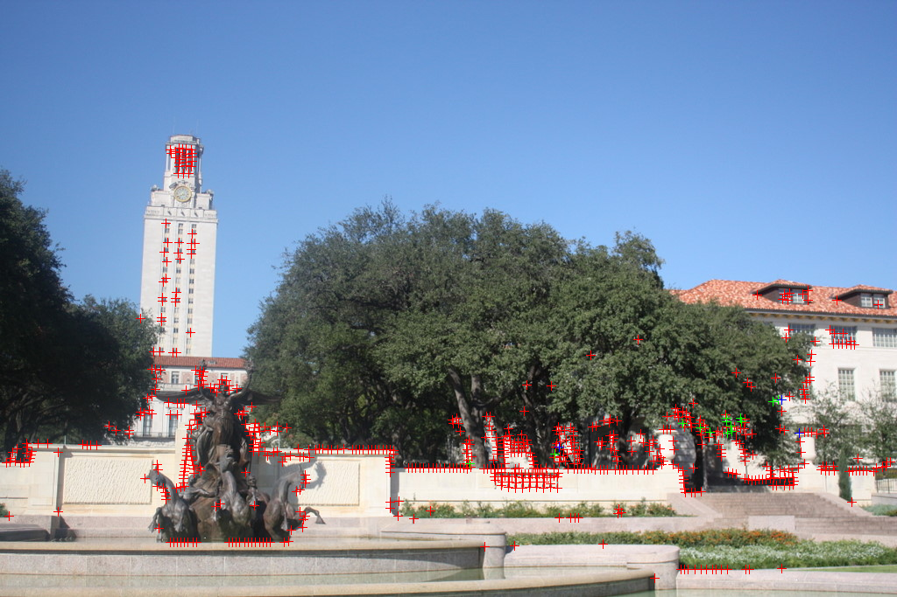
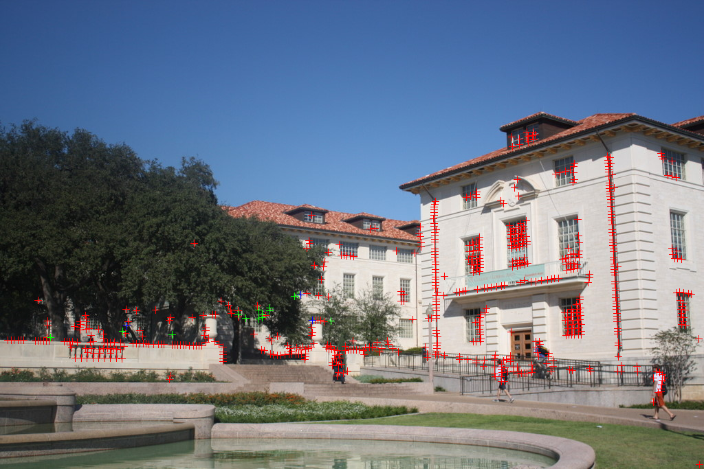
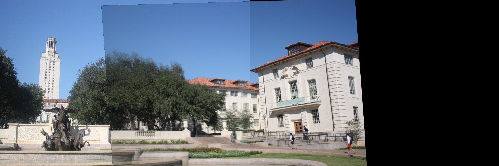

# image-stitcher

This is an image stitching program that is written in C++ from scratch. It can stitch two images to be a panorama. 
It serves as good exercise for me by implementing some fundamental computer vision algorithms that I learnt 
in university a few years ago.

## Development Toolchain
* Ubuntu 16.04 64-bit
* VIM - Vi IMproved 8.0
* GNU gdb 7.11.1
* cmake/make

## Dependencies
* gcc >= 4.7 (supports C++11)
* [Eigen](http://eigen.tuxfamily.org/index.php?title=Main_Page)
* [OpenMP](http://www.openmp.org/)
* OpenCV

## Compile
```
$ git submodule update --init --recursive
$ cd build && cmake .. && make -j8
```

## Algorithms and Details
1. Load two provided images, and convert them to grayscale images.
2. Detect feature points using the Harris corner detection algorithm:
	* Compute Gaussian derivatives at each pixel;
	* Compute second moment matrix M in a Gaussian window around each pixel;
	* Compute corner response function R;
	* Threshold the Harris response R by percentage;
	* Find local maxima of response function (nonmaximum suppression).
3. Extract fixed size image patches around every feature point, and form a descriptor simply by vectorizing the image pixel value in raster scan order.
4. Compute the normalized correlation between every descriptor in one image and every descriptor in the other image.
5. Select the top few hundred descriptor pairs with the largest normalized correlation values. Note each point in one image can only be paired with one point in the other image.
6. Run RANSAC to estimate the fundamental matrix of these two images using the normalized eight point algorithm.
7. Run RANSAC to obtain the affine transformation using the correspondences built from the feature matching. Stitch the images together by warping one image to the other using the affine transformation.
8. Create a paranoramic image by appropriately blending the color pixel values in the overlapping zone of the warped image and the other image.

## Example
The red plus marks in the follwing two images indicate the detected corner points. The green marks show the matched feature
points in the two images. The blue marks are the three pairs of feature point that were used for the affine transformation.




## References
* https://github.com/srinath1905/GRANSAC
* https://github.com/alexanderb14/Harris-Corner-Detector
